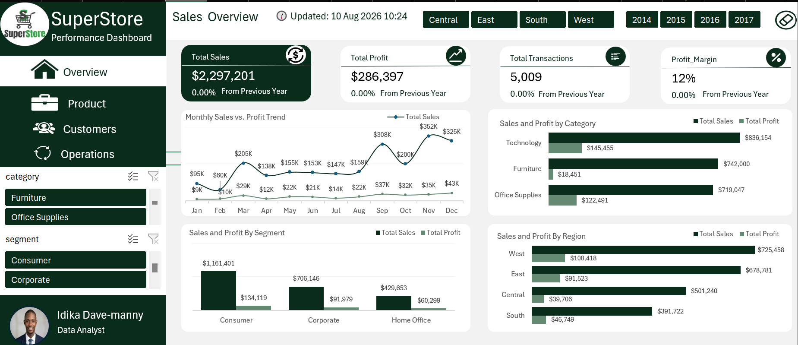
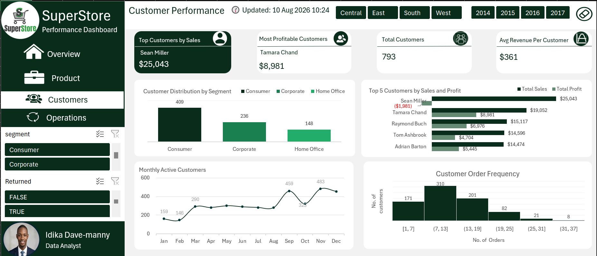
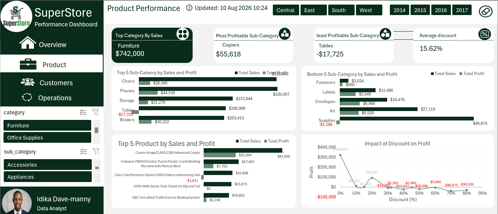
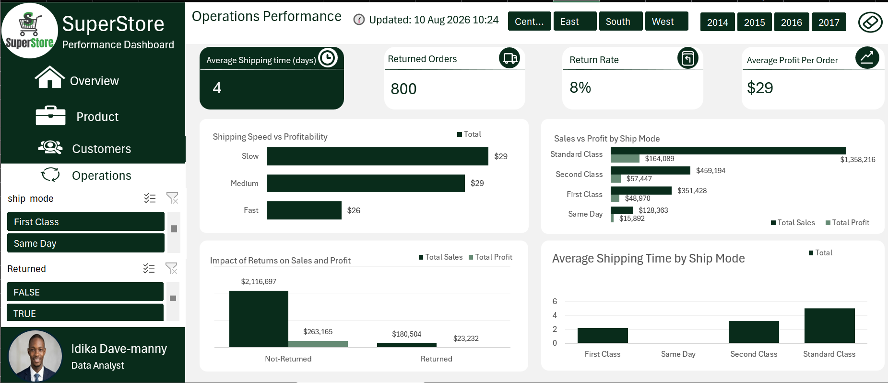

# Superstore Sales Analysis 

## Project Overview 
This project analyses Superstore sales data to identify sales trends, profitable products, valuable customer segments, and operational factors affecting profit.

## Business Problem
The Superstore dataset contains information on sales, profit, customers, products, and regional performance. However, raw transactional data can make it difficult to identify trends, evaluate business performance, and determine which areas require attention.

The goal of this project is to transform the raw Superstore data into meaningful insights through data cleaning, analysis, visualization, and dashboard development. The analysis aims to provide a clearer understanding of sales and profitability and support data-driven business decisions.

## Business Questions
- What are the overall sales and profit performance?
- How do sales and profit change over time?
- Which product categories and sub-categories generate the most sales and profit?
- Which products contribute most to overall performance?
- Which regions, states, or locations perform best and worst?
- Who are the most valuable customers based on sales and profit?
- Are there areas where high sales do not translate into high profit?
- What trends or patterns can be identified from the data?
- What insights can be used to improve overall business performance?

## Tools and Skills
### Tools 
- Microsoft Excel
- Power BI
- Power Query
- PowerPoint
- GitHub
### Skills
- Data Cleaning & Transformation
- Exploratory Data Analysis
- Data Analysis
- Data Visualization
- KPI Development
- Dashboard Design
- Business Intelligence
- Data Storytelling
- Insight Generation
- Report Development

## Dataset
[Superstore_data](Superstore_data.xlsm)

## Presentation
[Superstore_Sales_Performance_Analysis](Superstore_Sales_Performance_Analysis.pptx)

## Dashboard Development
The project includes an interactive dashboard divided into four pages designed to provide a clear overview of Superstore sales performance. The dashboard brings key business metrics and visualizations together in one place, allowing users to explore performance across different dimensions such as time, products, customers, and geography.

### Dashboard Features
- Interactive Slicers
- Multi-page navigation
- VBA reset button
- Dynamic KPI's
- Last Updated Indicator
- Dashboard Storytelling

## Dashboard Pages 
### Sales Overview

The purpose of the Sales Overview dashboard is to provide a high-level view of SuperStore's overall business performance. 

### KPIs
- Total Sales
- Total Profit
- Total Transactions
- Profit Margin

### Insights
- SuperStore generated $2.30M in total sales and $286.40K in profit, with an overall 12% profit margin across 5,009 transactions.
- Sales rise strongly toward the final months of the year.
- The West region generates the highest sales.
- Technology produces the highest profit among the main categories.

## Customer Performance Page

The purpose of the Customer Performance dashboard is to understand customer behavior, value, and engagement. 

### KPIs
- Top Customers by Sales
- Most Profitable Customers
- Total Customers
- Average Revenue by Customers
### Insights
- The business has 793 customers, with an average revenue of approximately $361 per customer.
- Sean Miller generated the highest sales among customers at $25.04K, but recorded a -$1.98K profit, showing that high sales do not necessarily translate into profitability.
- Tamara Chand was the most profitable customer, generating approximately $8.98K in profit from $19.05K in sales.
- Most customers placed between 7 and 13 orders, representing the largest order-frequency group with 310 customers.
- Monthly active customers increased significantly toward the end of the year, reaching 459 in September and a peak of 483 in November.

## Product Performance Page

The purpose of the Product Performance dashboard is to evaluate product and sub-category performance, identify high- and low-performing products, and examine how discounting affects profitability. 

### KPIs
- Top Category by Sales
- Most Profitable sub-category
- Least Profitable sub-category
- Average Discount

### Insights
- Furniture was the top category by sales, generating approximately $742.00K.
- Copiers were the most profitable sub-category, generating approximately $55.62K in profit.
- Tables were the least profitable sub-category, generating a -$17.73K loss despite approximately $206.97K in sales.
- Higher discount levels are linked with falling profit and losses.

## Operations Performance Page

The purpose of the Operations Performance dashboard is to evaluate the efficiency and financial impact of order fulfillment. 

### KPIs
- Avearge Shipping time(days)
- Returned Orders
- Return Rate
- Average profit per order

### Insghts
- The average shipping time is approximately 4 days, while the business recorded 800 returned orders, resulting in an 8% return rate.
- The average profit per order is approximately $29.
- Standard Class generated the highest sales at $1.36M and the highest profit at $164.09K, making it the dominant shipping method.
- Same Day shipping generated the lowest sales ($128.36K) and profit ($15.89K).
- Returned orders generate far less sales and profit than non-returned orders.

## Report Findings 
### Key Findings

- ### Strong overall sales performance: 
 SuperStore generated $2.30M in sales and $286.40K in profit, achieving an overall 12% profit margin across 5,009 transactions.
- ### Technology leads profitability: 
 Technology was the strongest category, generating $836.15K in sales and $145.46K in profit. It contributed substantially more profit than Furniture despite Furniture's high sales volume.
-  ### High sales do not always mean high profitability:
 Furniture generated $742.00K in sales but only $18.45K in profit, while Tables generated approximately $206.97K in sales but recorded a $17.73K loss.
- ### West is the strongest region:
 The West generated the highest regional sales at approximately $725.46K, followed by the East at $678.78K.
- ### Customer value varies significantly:
 Sean Miller was the highest-selling customer at $25.04K, but generated a $1.98K loss, while Tamara Chand generated the highest customer profit at approximately $8.98K.
- ### Returns impact profitability:
 Returned orders accounted for approximately $180.50K in sales and $23.23K in profit, compared with $2.12M in sales and $263.17K in profit from non-returned orders. The overall return rate was 8%.
- ### Discounting can erode profit:
 The product analysis shows profitability declining as discount levels increase, with several high-discount levels producing negative profit.
- ### Standard Class dominates shipping:
 Standard Class generated approximately $1.36M in sales and $164.09K in profit, making it the largest contributor among shipping methods.
- ### Customer activity increases toward year-end:
 Monthly active customers reached 483 in November, while sales also peaked in November at approximately *$352K, suggesting strong customer and sales activity toward the end of the year.

### Overall Finding

The analysis shows that **revenue growth alone is not sufficient to measure business performance**. Profitability is strongly influenced by product mix, discounting, customer value, returns, and operational decisions. The biggest opportunities lie in improving the profitability of high-sales products and categories, controlling excessive discounts, and reducing the financial impact of returned orders.

## Recommendations
- Review discounts above 20%, especially on low-margin products.
- Investigate why Tables produces losses despite strong sales.
- Prioritise profitable sub-categories such as Accessories.
- Maintain strong service for high-value customers and the Consumer segment
- Review return reasons and reduce preventable returns.
- Monitor Standard Class shipping performance because it drives the largest share of sales.
